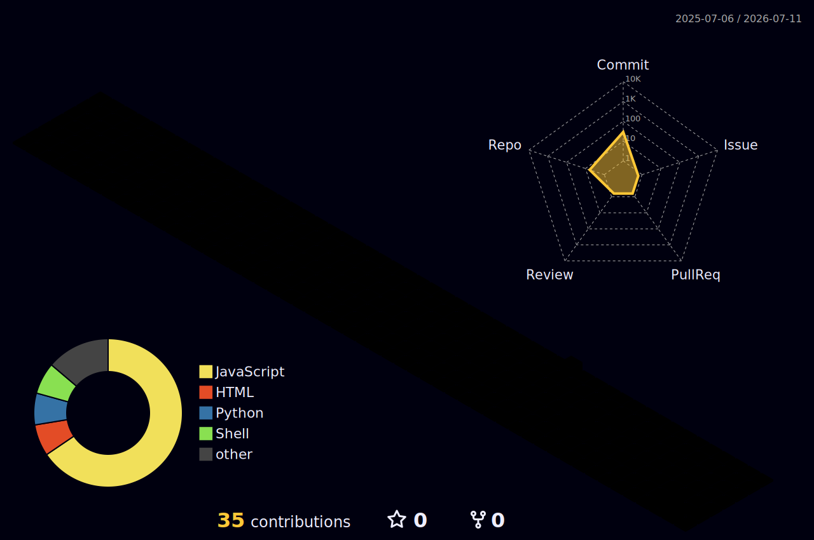

<div align="center">


[](https://git.io/typing-svg)

<p>
  
  
  
</p>

<p>
  <a href="#mission-control"></a>
  <a href="#featured-build"></a>
  <a href="#open-source-lab"></a>
  <a href="#embedded-edge"></a>
  <a href="#github-signal"></a>
</p>



</div>

## Mission Control

I build complete systems: interface, API, database, automation, deployment, and the hardware edge where software touches the real world.

```txt
browser UI -> API engine -> database -> realtime layer -> cloud -> device edge
```

<details open>
<summary><b>Open system map</b></summary>

| Layer | Signal |
| --- | --- |
| Frontend Cockpit | Responsive UI, dashboards, 3D scenes, product polish |
| Backend Core | REST APIs, auth, reports, data models, realtime flows |
| Data & AI Engine | Optimization, automation, AI-assisted workflows, analytics |
| Cloud & DevOps | Linux, Docker-minded deployment, CI/CD habits, production hygiene |
| Embedded Edge | C/C++, Arduino/ESP32/STM32 direction, sensors, MQTT, UART/I2C/SPI |
| Product Layer | Practical UX, performance, security basics, finished-feeling systems |

</details>

<details>
<summary><b>Run: scan --full-stack</b></summary>

```yaml
frontend:
  - React / Next.js direction
  - HTML / CSS / Tailwind
  - Three.js and interactive visual systems
backend:
  - Node.js / Express
  - MongoDB / PostgreSQL direction
  - JWT auth, file pipelines, reports, APIs
systems:
  - Linux, Git, GitHub, Docker-minded workflow
  - realtime architecture and service boundaries
ai_data:
  - optimization logic
  - automation pipelines
  - AI-assisted product engineering
```

</details>

<details>
<summary><b>Run: scan --hardware-edge</b></summary>

```yaml
embedded:
  languages: [C, C++]
  boards: [Arduino, ESP32, STM32, Raspberry Pi]
  protocols: [UART, I2C, SPI, MQTT]
  direction:
    - sensor telemetry
    - firmware fundamentals
    - device-to-cloud bridges
    - automation that connects code with physical systems
```

</details>

## Tech Radar

<div align="center">

[](https://skillicons.dev)

<br />


</div>

## Featured Build

<table>
  <tr>
    <td width="52%">
      <h3>Container Packing Pro</h3>
      <p>
        A full-stack logistics planner for smarter container loading with 3D visualization,
        optimization logic, authenticated workflows, Excel import, PDF reports, and public sharing.
      </p>
      <p>
        <a href="https://github.com/Dun1702/container-packing">
          
        </a>
        <a href="https://github.com/Dun1702/container-packing#readme">
          
        </a>
      </p>
    </td>
    <td width="48%">
      <a href="https://github.com/Dun1702/container-packing">
        
      </a>
    </td>
  </tr>
</table>

<details open>
<summary><b>Project cockpit</b></summary>

| System | Built signal |
| --- | --- |
| 3D Engine | Interactive container scene with Three.js |
| API Core | Node.js, Express, MongoDB, JWT |
| Optimization | COG, load-balance, axle score, multi-container selection |
| Workflow | Excel import/template, reports, shareable public views |
| Product Feel | Operational UI for logistics planning and load inspection |

</details>

## Open Source Lab

Public source built as reusable foundations: real problems, clean architecture, quick-start docs, tests where they matter, and deployable demos.

<table>
  <tr>
    <td width="50%">
      <h3>FleetPulse IoT Hub</h3>
      <p>Device-to-cloud telemetry starter for ESP32/STM32 fleets with ingest API, device state, alert scoring, simulator, and tests.</p>
      <p>
        <a href="https://github.com/Dun1702/fleetpulse-iot-hub">
          
        </a>
        
        
      </p>
    </td>
    <td width="50%">
      <h3>InvoiceLens AI Pipeline</h3>
      <p>Python invoice extraction pipeline with structured JSON/CSV output, validation flags, confidence scoring, sample invoice, and tests.</p>
      <p>
        <a href="https://github.com/Dun1702/invoicelens-ai-pipeline">
          
        </a>
        
        
      </p>
    </td>
  </tr>
  <tr>
    <td width="50%">
      <h3>WarehouseFlow OS</h3>
      <p>Warehouse workflow API for receiving stock, moving bins, pick tasks, inventory snapshots, event history, and operator analytics.</p>
      <p>
        <a href="https://github.com/Dun1702/warehouseflow-os">
          
        </a>
        
        
      </p>
    </td>
    <td width="50%">
      <h3>LaunchOps Kit</h3>
      <p>Production-minded deployment kit with Docker Compose, Nginx, GitHub Actions CI, healthcheck script, release checklist, and backup policy.</p>
      <p>
        <a href="https://github.com/Dun1702/launchops-kit">
          
        </a>
        
        
      </p>
    </td>
  </tr>
</table>

<details open>
<summary><b>Open-source quality bar</b></summary>

| Repo | Problem solved | Source signal |
| --- | --- | --- |
| [container-packing](https://github.com/Dun1702/container-packing) | Logistics loading and 3D inspection | Full-stack flagship build |
| [fleetpulse-iot-hub](https://github.com/Dun1702/fleetpulse-iot-hub) | Device telemetry and alerting | Node API, simulator, tests |
| [invoicelens-ai-pipeline](https://github.com/Dun1702/invoicelens-ai-pipeline) | Invoice extraction workflow | Python CLI, parser, sample, tests |
| [warehouseflow-os](https://github.com/Dun1702/warehouseflow-os) | Warehouse inventory operations | Workflow API, event ledger, tests |
| [launchops-kit](https://github.com/Dun1702/launchops-kit) | Deployment and release hygiene | Docker, Nginx, CI, ops docs |

</details>

## Embedded Edge

<details open>
<summary><b>Why embedded belongs in my stack</b></summary>

Modern products do not stop at the browser. The real magic happens when software can move through the whole chain: UI, backend, data, automation, and device telemetry.

```txt
sensor -> firmware -> protocol -> broker/API -> dashboard -> decision
```

</details>

<details>
<summary><b>Device-cloud bridge blueprint</b></summary>

| Stage | Direction |
| --- | --- |
| Firmware | Read sensors, control actuators, keep timing stable |
| Protocol | MQTT, UART, I2C, SPI, serial debugging |
| Backend | Ingest telemetry, validate events, persist state |
| UI | Realtime dashboards, alerts, charts, operator controls |
| Automation | Rules, reports, optimization, AI-assisted insights |

</details>

## Current Direction

```yaml
focus:
  - full-stack products that are useful end to end
  - 3D web apps, realtime interfaces, and operational dashboards
  - backend systems with clean APIs, auth, data models, and reports
  - optimization, automation, and AI-assisted engineering workflows
  - embedded/IoT: firmware basics, sensors, telemetry, and device-cloud bridges
```

## GitHub Signal

<div align="center">


<br />


<br />
<br />


</div>

<details>
<summary><b>Activate 3D contribution layer</b></summary>

This panel is generated by GitHub Actions after the profile workflow runs.



</details>

## Build Philosophy

I care about products that feel complete: clear interfaces, understandable APIs, reliable data flow, measurable performance, and hardware/software pieces that can talk to each other.

> Strong software is not only code that runs. It is code that explains itself, scales with the idea, and survives real users.

<div align="center">

<a href="#mission-control"></a>

<br />
<br />


</div>
